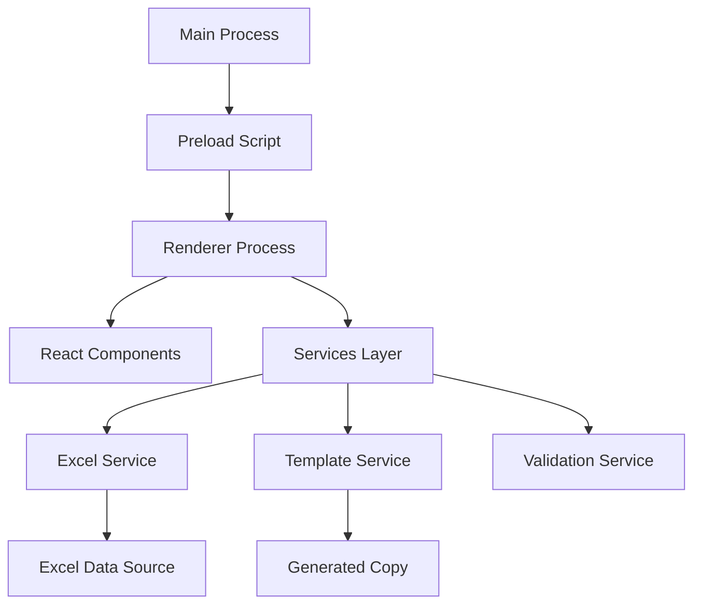
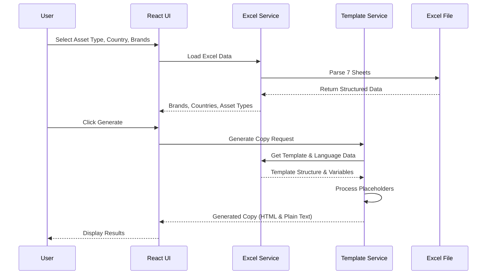

# Digital Compliance Legal Copy Generator

> A modern Electron desktop application for generating compliant legal copy for digital marketing assets, replacing the legacy Google Sites implementation with a professional, offline-capable solution.

## 📋 Table of Contents

- [Overview](#overview)
- [Technology Stack](#technology-stack)
- [Architecture](#architecture)
- [Project Structure](#project-structure)
- [Development Setup](#development-setup)
- [Build Process](#build-process)
- [Data Sources](#data-sources)
- [Deployment](#deployment)
- [IT Team Handover](#it-team-handover)
- [Future Roadmap](#future-roadmap)

## 🎯 Overview

The Digital Compliance Tool is a desktop application that generates legally compliant copy for Brown-Forman's digital marketing assets across multiple countries, languages, and brand portfolios. It processes complex trademark, regulatory, and compliance requirements through an Excel-driven template engine.

### Key Features

- **Multi-Language Support**: 30+ languages with country-specific compliance rules
- **Brand Portfolio Management**: Individual brands and multi-brand portfolios (Bar-Fabric, etc.)
- **Template Engine**: Sophisticated placeholder system for dynamic content generation
- **Excel Integration**: Direct processing of trademark data from Excel sheets
- **History Management**: Track, search, and export generation history
- **Offline Operation**: No internet dependency for core functionality
- **Professional UI**: Modern interface matching existing design standards

### Business Value

- **Compliance Assurance**: Eliminates manual errors in legal copy generation
- **Efficiency**: Reduces copy generation time from minutes to seconds
- **Scalability**: Supports expanding brand portfolio and international markets
- **Audit Trail**: Complete history of generated copy for compliance tracking
- **Future-Ready**: Architecture supports API integration with DAM systems

## 🛠️ Technology Stack

### Core Technologies

| Technology | Version | Purpose |
|-----------|---------|---------|
| **Electron** | 28.x | Desktop application framework |
| **React** | 18.x | Frontend UI library |
| **Node.js** | 18.x | JavaScript runtime |
| **Webpack** | 5.x | Module bundler and build tool |

### UI & Styling

| Technology | Purpose |
|-----------|---------|
| **Tailwind CSS** | Utility-first CSS framework |
| **Lucide React** | Icon library |
| **PostCSS** | CSS processing |

### Data Processing

| Technology | Purpose |
|-----------|---------|
| **SheetJS (XLSX)** | Excel file parsing and processing |
| **PapaParse** | CSV parsing (future use) |

### Build & Development

| Technology | Purpose |
|-----------|---------|
| **Babel** | JavaScript transpilation |
| **ESLint** | Code linting |
| **Prettier** | Code formatting |
| **Electron Builder** | Application packaging |

### Testing & Quality

| Technology | Purpose |
|-----------|---------|
| **Custom Scripts** | Application testing |
| **GitHub Actions** | CI/CD pipeline |

## 🏗️ Architecture

### Application Architecture



### Data Flow



### Security Model

- **Process Isolation**: Main, renderer, and preload processes isolated
- **Context Isolation**: Secure IPC communication bridge
- **No Node Integration**: Renderer process sandboxed
- **Input Validation**: All user inputs validated and sanitized
- **File System Access**: Restricted to designated data directories

## 📁 Project Structure

```
digital-compliance-tool/
├── 📄 README.md                          # This file
├── 📄 package.json                       # Project configuration & dependencies
├── 📄 .gitignore                         # Git ignore rules
├── 📄 .eslintrc.js                       # ESLint configuration
├── 📄 .prettierrc                        # Prettier configuration
├── 📄 babel.config.js                    # Babel transpilation config
├── 📄 tailwind.config.js                 # Tailwind CSS configuration
├── 📄 postcss.config.js                  # PostCSS configuration
│
├── 📁 src/                               # Source code
│   ├── 📁 main/                          # Electron main process
│   │   ├── 📄 main.js                    # Main process entry point
│   │   ├── 📄 menu.js                    # Application menu setup
│   │   ├── 📄 security.js                # Security policies & CSP
│   │   └── 📄 updater.js                 # Auto-updater configuration
│   │
│   ├── 📁 preload/                       # Secure IPC bridge
│   │   └── 📄 preload.js                 # Context bridge API exposure
│   │
│   └── 📁 renderer/                      # React frontend application
│       ├── 📄 index.html                 # HTML template
│       ├── 📄 index.js                   # React application entry point
│       ├── 📄 App.jsx                    # Main React component
│       │
│       ├── 📁 components/                # React UI components
│       │   ├── 📁 common/               # Reusable components
│       │   │   ├── 📄 Header.jsx         # Application header
│       │   │   ├── 📄 Footer.jsx         # Application footer
│       │   │   ├── 📄 LoadingSpinner.jsx # Loading indicator
│       │   │   └── 📄 ErrorBoundary.jsx  # Error handling wrapper
│       │   │
│       │   ├── 📁 forms/                # Form input components
│       │   │   ├── 📄 AssetTypeSelector.jsx    # Asset type dropdown
│       │   │   ├── 📄 CountrySelector.jsx      # Country search/select
│       │   │   ├── 📄 BrandSelector.jsx        # Brand grid selection
│       │   │   └── 📄 GenerateButton.jsx       # Copy generation trigger
│       │   │
│       │   └── 📁 output/               # Copy display components
│       │       ├── 📄 GeneratedCopy.jsx        # Copy output display
│       │       ├── 📄 CopyButton.jsx           # Clipboard functionality
│       │       └── 📄 HistoryPanel.jsx         # Generation history
│       │
│       ├── 📁 hooks/                    # React custom hooks
│       │   ├── 📄 useDataLoader.js       # Excel data loading hook
│       │   ├── 📄 useTemplateEngine.js   # Copy generation hook
│       │   └── 📄 useClipboard.js        # Clipboard operations hook
│       │
│       ├── 📁 services/                 # Business logic layer
│       │   ├── 📄 excelService.js        # Excel parsing & data management
│       │   ├── 📄 templateService.js     # Copy generation engine
│       │   ├── 📄 validationService.js   # Input validation
│       │   └── 📄 apiService.js          # Future API integration layer
│       │
│       ├── 📁 utils/                    # Utility functions
│       │   ├── 📄 constants.js           # Application constants
│       │   ├── 📄 helpers.js             # Helper functions
│       │   └── 📄 logger.js              # Logging utilities
│       │
│       └── 📁 styles/                   # CSS styling
│           ├── 📄 globals.css            # Global styles (Tailwind)
│           └── 📄 components.css         # Component-specific styles
│
├── 📁 config/                           # Build configuration
│   ├── 📄 webpack.config.js              # Webpack build configuration
│   ├── 📄 forge.config.js                # Electron Forge packaging
│   ├── 📄 security.config.js             # Security policies
│   └── 📁 environments/                 # Environment-specific configs
│       ├── 📄 development.json           # Development environment
│       ├── 📄 production.json            # Production environment
│       └── 📄 intranet.json              # Future intranet deployment
│
├── 📁 data/                             # Application data
│   ├── 📁 templates/                    # Excel data templates
│   │   ├── 📄 trademark-data.xlsx        # Main trademark data source
│   │   └── 📄 data-schema.json           # Data validation schema
│   └── 📁 samples/                      # Sample/demo data
│       └── 📄 sample-data.xlsx           # Non-sensitive test data
│
├── 📁 assets/                           # Static assets
│   ├── 📁 icons/                        # Application icons
│   │   ├── 📄 icon.png                   # PNG icon (512x512)
│   │   ├── 📄 icon.ico                   # Windows icon
│   │   └── 📄 icon.icns                  # macOS icon
│   └── 📁 images/                       # Other images
│       └── 📄 logo.png                   # Application logo
│
├── 📁 scripts/                          # Build & utility scripts
│   ├── 📄 build.js                       # Production build script
│   ├── 📄 package.js                     # Application packaging
│   ├── 📄 setup-dev.js                   # Development environment setup
│   ├── 📄 copy-resources.js              # Resource copying utility
│   └── 📁 migration/                     # Future migration utilities
│       ├── 📄 excel-to-api.js            # API migration helper
│       └── 📄 data-cleanup.js            # Data sanitization
│
├── 📁 docs/                             # Documentation
│   ├── 📄 01_SETUP.md                    # Project initialization guide
│   ├── 📄 02_WEBPACK_CONFIG.md           # Build system setup
│   ├── 📄 03_MAIN_PROCESS.md             # Electron main process
│   ├── 📄 04_PRELOAD_SCRIPT.md           # IPC bridge setup
│   ├── 📄 05_EXCEL_SERVICE.md            # Excel data processing
│   ├── 📄 06_TEMPLATE_ENGINE.md          # Copy generation engine
│   ├── 📄 07_UI_COMPONENTS.md            # React components
│   ├── 📄 08_OUTPUT_COMPONENTS.md        # Copy output & history
│   ├── 📄 09_FINAL_POLISH.md             # Performance & accessibility
│   ├── 📄 10_BUILD_PACKAGE.md            # Final build & deployment
│   ├── 📄 API_MIGRATION.md               # Future API integration guide
│   ├── 📄 DEPLOYMENT.md                  # Deployment instructions
│   ├── 📄 SECURITY.md                    # Security guidelines
│   ├── 📄 DEVELOPMENT.md                 # Development setup guide
│   └── 📄 TROUBLESHOOTING.md             # Common issues & solutions
│
├── 📁 tests/                            # Testing files
│   ├── 📁 unit/                         # Unit tests
│   ├── 📁 integration/                  # Integration tests
│   │   └── 📄 data-processing.test.js    # Data processing tests
│   └── 📁 e2e/                          # End-to-end tests
│       └── 📄 app.test.js                # Application flow tests
│
├── 📁 .github/                          # GitHub configuration
│   ├── 📁 workflows/                    # CI/CD workflows
│   │   ├── 📄 build.yml                  # Build automation
│   │   ├── 📄 code-quality.yml           # Code quality checks
│   │   └── 📄 security-scan.yml          # Security scanning
│   ├── 📁 ISSUE_TEMPLATE/               # Issue templates
│   │   ├── 📄 bug_report.md              # Bug report template
│   │   ├── 📄 feature_request.md         # Feature request template
│   │   └── 📄 security_issue.md          # Security issue template
│   └── 📄 pull_request_template.md       # PR template
│
├── 📁 build/                            # Build artifacts (generated)
├── 📁 dist/                             # Development build output
├── 📁 dist-electron/                    # Production build output
└── 📁 node_modules/                     # Dependencies (generated)
```

## 🔧 Development Setup

### Prerequisites

- **Node.js**: Version 18.x or higher
- **npm**: Version 9.x or higher
- **Git**: For version control
- **Windows**: For building Windows executables (recommended)

### Quick Start

1. **Clone & Navigate**
   ```bash
   git clone <repository-url>
   cd digital-compliance-tool
   ```

2. **Install Dependencies**
   ```bash
   npm install
   ```

3. **Prepare Data**
   ```bash
   # Copy Excel file to correct location
   cp "EXTERNAL  Trademark Tool Data 1.xlsx" data/templates/trademark-data.xlsx
   ```

4. **Start Development**
   ```bash
   npm start
   ```

### Development Commands

| Command | Purpose |
|---------|---------|
| `npm start` | Start development server with hot reload |
| `npm run electron` | Launch Electron app (after webpack build) |
| `npm run build` | Create production build |
| `npm test` | Run application tests |
| `npm run package:win` | Build Windows installer |
| `npm run package:mac` | Build macOS installer |
| `npm run package:linux` | Build Linux package |
| `npm run clean` | Clean build directories |

### Development Workflow

1. **Follow Sequential Setup**: Use markdown files `01_SETUP.md` through `10_BUILD_PACKAGE.md`
2. **Component Development**: Build UI components in `src/renderer/components/`
3. **Service Integration**: Implement business logic in `src/renderer/services/`
4. **Testing**: Validate functionality at each stage
5. **Build & Package**: Create distributable installer

## 🔨 Build Process

### Development Build
```bash
# Webpack development server
npm run webpack-dev

# Electron in development mode
npm run electron:dev
```

### Production Build
```bash
# Create optimized build
npm run build

# Package for distribution
npm run package

# Platform-specific builds
npm run package:win    # Windows .exe installer
npm run package:mac    # macOS .dmg installer  
npm run package:linux  # Linux .deb package
```

### Build Output

| File | Description |
|------|-------------|
| `dist-electron/Digital Compliance Tool-1.0.0-Setup.exe` | Windows installer |
| `dist-electron/Digital Compliance Tool-1.0.0.dmg` | macOS installer |
| `dist-electron/digital-compliance-tool_1.0.0_amd64.deb` | Linux package |

## 📊 Data Sources

### Excel File Structure

The application processes a single Excel file with 7 interconnected sheets:

| Sheet Name | Purpose | Key Data |
|-----------|---------|----------|
| **Trademark Config** | Brand and asset type definitions | Brands, entities, asset types, instructions |
| **CountryLanguage** | Country-language mappings | Country codes, languages, market specifics |
| **Trademark Language** | Language-specific trademark text | Registered language, reserve language |
| **Trademark Structure** | Template structures by type | Full, tightened, limited character formats |
| **Language Dependent Variables** | Country-specific compliance text | Responsibility language, forward notices |
| **Overall Structure** | Asset-type template mapping | Template structures for each asset type |
| **Help Text** | User interface instructions | HTML-formatted help content |

### Data Processing Flow

1. **Excel Loading**: File read via Node.js filesystem API
2. **Sheet Parsing**: Each sheet processed using SheetJS library
3. **Data Validation**: Structure and content validation
4. **Memory Storage**: Parsed data cached in service layer
5. **Template Processing**: Dynamic placeholder replacement
6. **Output Generation**: HTML and plain text copy creation

## 🚀 Deployment

### Desktop Application Deployment

**Windows Deployment:**
- Creates NSIS installer executable
- Includes Excel file in installation directory
- Registers Start Menu shortcuts
- Supports silent installation for enterprise deployment

**Installation Path:**
- Default: `C:\Program Files\Digital Compliance Tool\`
- Data: `C:\Program Files\Digital Compliance Tool\data\templates\trademark-data.xlsx`

### Distribution Checklist

- [ ] Excel file updated with latest trademark data
- [ ] Version number incremented in package.json
- [ ] Build tests pass (`npm test`)
- [ ] Production build successful (`npm run package:win`)
- [ ] Installer tested on clean machine
- [ ] Application launches and loads data correctly
- [ ] Copy generation working end-to-end
- [ ] All UI components functional

## 👥 IT Team Handover

### Knowledge Transfer Priorities

1. **Architecture Understanding**
   - Review `docs/` directory for complete technical documentation
   - Understand Electron security model and IPC communication
   - Excel data structure and template engine logic

2. **Development Environment**
   - Node.js development workflow
   - React component architecture
   - Webpack build system
   - Electron packaging process

3. **Data Management**
   - Excel file structure and update procedures
   - Template engine placeholder system
   - Multi-language support implementation

4. **Deployment Process**
   - Build and packaging workflow
   - Installer creation and distribution
   - Enterprise deployment considerations

### Key Technical Contacts

- **Frontend Architecture**: React components and hooks
- **Backend Logic**: Excel processing and template engine
- **Build System**: Webpack and Electron packaging
- **Security**: IPC communication and sandboxing

### Maintenance Tasks

| Task | Frequency | Description |
|------|-----------|-------------|
| **Data Updates** | As needed | Update Excel file with new trademark data |
| **Dependency Updates** | Monthly | Update npm packages for security patches |
| **Feature Enhancements** | Quarterly | Add new asset types or compliance requirements |
| **Performance Monitoring** | Ongoing | Monitor application performance and memory usage |

## 🗺️ Future Roadmap

### Phase 2: Intranet Web Application
- **Timeline**: NA
- **Technology**: React web app with Node.js backend
- **Database**: PostgreSQL or MongoDB
- **Authentication**: Active Directory integration
- **Deployment**: Internal web servers

### Phase 3: API Integration with BAR+
- **Timeline**: NA  
- **Integration**: Tenovos DAM system
- **Features**: Asset metadata sync, automated copy injection
- **Architecture**: RESTful API with webhook support

### External Resources
- [Electron Documentation](https://www.electronjs.org/docs)
- [React Documentation](https://reactjs.org/docs)
- [Tailwind CSS](https://tailwindcss.com/docs)
- [SheetJS Documentation](https://docs.sheetjs.com/)


---

**Built with ❤️ for Marketing Compliance**  
*Ensuring legal compliance across digital marketing assets worldwide*